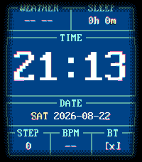

# Nostalgic Commander

A Norton Commander-styled watchface for Pebble: time, date, and the data you
care about, in exact EGA colors — cyan frames over panel blue, the dimmed
shadow of it after dark. Text over icons, contrast over decoration, utility
over hand-holding.



Built for the modern Pebble lineup; currently targets **emery**
(Pebble Time 2).

Nostalgic Commander is forked from
[tuiface](https://github.com/lizwinn/tuiface) by Elizardbeth and reworked
hard toward the DOS aesthetic: VGA bitmap font, EGA palettes, block-glyph
progress bars, .beat time. The backbone — the complication system, weather
pipeline, test harness, much of the runtime — is upstream's work. See
[License](#license); the upstream copyright notice ships unchanged.

## Gallery

| Minimal | Time & system | Weather |
|---|---|---|
|  |  |  |

| Dark | Navigator |
|---|---|
|  |  |

The captures are scripted: `make screenshots` rebuilds all of them from the
emulator (`tools/update_screenshots.sh`).

## Features

- **Big, legible time** in an IBM VGA 8x16 bitmap font at 4x, with your choice
  of date formats (`1970-12-31`, `31-12-1970`, `DEC 31st, 1970`, or the
  year-less short form), and the weekday before, after, or hidden.
- **Six complication slots** (two wide on top, three below, one wide in the
  middle), each filled from the curated complication set or left empty. The
  set is maintained in one place — `OPTION_LABELS` in `src/pkjs/config.js` —
  so the settings page and this file can't drift apart.
- **The middle slot** holds the date, a full-weather strip (condition,
  current temp, humidity and precipitation as captioned status chips), or a
  DOS progress bar for steps or battery — `█` blocks against a `░` track,
  with the percentage after it.
- **Four DOS/EGA themes, Norton by default.** Turbo Vision (the menu bar,
  black frames and captions, red hotkey letters on light grey), Norton (the
  Commander panel, cyan frames, white entries over EGA blue), Dark (the
  same panel dimmed to grey chrome on black, the way Turbo Vision faked
  it), and Navigator (dark grey ground, white chrome, yellow hotkey
  marks). Exact EGA colors, since Pebble's display uses the same channel
  steps.
- **Colors only when something needs attention**: temperature runs
  red-hot / blue-cold, AQI and UV go yellow then red past their thresholds,
  battery goes yellow then red as it drains — and green on the charger.
- **Weather without an API key** — data comes from
  [Open-Meteo](https://open-meteo.com) via your phone's location, refreshed
  every 30 minutes.

## Configuration

Open the watchface settings in the Pebble mobile app. Settings are
deliberately few:

| Setting | Options |
|---------|---------|
| Theme | Turbo Vision, Norton, Dark, Navigator |
| Units | Imperial, Metric |
| Date format | ISO, DOS, full text, short |
| Short date format | Month-Day, Day-Month |
| Day of week | Before date, after date, hidden |
| CRT effect | On, off (default) |
| CRT degauss sound | On, off (default) |
| Slots 1–6 | Data source per slot, or Empty |

That's the whole surface. Good defaults over knobs; if a behavior isn't
configurable, that's a decision, not an oversight.

## Philosophy

Inherited from upstream, held to more strictly, not less:

- **TUI-like, but legible.** The terminal aesthetic serves readability on a
  small e-paper-style screen; where the two conflict, legibility wins.
- **High-contrast themes.** Every palette keeps text sharply readable; muted,
  low-contrast color schemes are out of scope.
- **Curated complications.** Ever scrolled a settings page with a hundred
  complications trying to find the three you actually care about? Data sources
  are added deliberately and selectively.
- **Utility first.** When usefulness and approachability pull in different
  directions, useful wins.
- **Minimal configuration.** Every setting has to earn its place.
- **Fork-friendly.** This face only exists because upstream lives by that
  value. It applies here too: fork it, make it yours.

## Building from source

Requires the [Pebble SDK](https://developer.repebble.com):

```sh
pip install pebble-tool                  # CLI and emulators
pebble sdk install latest                # one-time SDK + toolchain
npm ci                                   # Clay, for the pkjs bundle
pebble build                          # build for all targetPlatforms
pebble install --emulator emery       # run on the emery emulator
pebble install --phone <ip>           # install to a paired phone
```

Run the unit tests (host-only, no SDK needed — requires `clang-format`,
`gcc`, and node ≥ 18 for `node --test`; `test/unity` is a submodule, so clone
with `--recurse-submodules`):

```sh
make test
```

### Visual gate

`make test` proves logic; the rendered face is pinned by a committed capture,
`test/visual/baseline.png`. The checker builds, installs on the emery
emulator, screenshots immediately after launch, and diffs against the
baseline after masking the regions that legitimately move (the clock row, the
centre date strip, the top-left weather slot):

```sh
make visual-check     # must report 0 differing pixels
make visual-baseline  # regenerate after an intentional visual change
```

Requires the emulator and ImageMagick's `compare` on PATH; assumes the
emulator's persisted settings are the shipped defaults (any deviated
persisted config renders differently by design).

## Development

- [AGENTS.md](AGENTS.md) / [CONTRIBUTING.md](CONTRIBUTING.md) — upstream's
  notes for agents and contributors; conventions here also apply
- [ISSUES.md](ISSUES.md) — known bugs · [TODOs.md](TODOs.md) — planned work ·
  [IDEAS.md](IDEAS.md) — undecided ideas

Full SDK docs, tutorials, and API reference: <https://developer.repebble.com>

## AI disclosure

Upstream tuiface was developed with assistance from AI coding agents —
Google's **Gemini** and Anthropic's **Claude** — and this fork continues the
same practice, under human direction and review. This includes code, tests,
and documentation.

If you'd rather not use a watchface built with AI assistance, that's
completely fair — no hard feelings.

## License

This project is licensed, like upstream, under the
[PolyForm Noncommercial License 1.0.0](LICENSE.md). In short: you may fork it,
modify it, and redistribute your own versions freely — for any
**noncommercial** purpose. Selling this watchface or a derivative of it is
not permitted. Upstream's required copyright notice ("Copyright Elizardbeth")
is retained in [LICENSE.md](LICENSE.md).

The bundled font is [Px437 IBM VGA 8x16](https://int10h.org/oldschool-pc-fonts/)
by VileR, with four diagonal arrows added, under
[CC BY-SA 4.0](https://creativecommons.org/licenses/by-sa/4.0/) — see
[docs/LICENSES.md](docs/LICENSES.md) for the full dependency audit.

Weather, UV, and air-quality data is provided by
[Open-Meteo.com](https://open-meteo.com/) (CC BY 4.0, free for non-commercial
use). See [docs/LICENSES.md](docs/LICENSES.md) for a full audit of upstream
dependency licenses.
